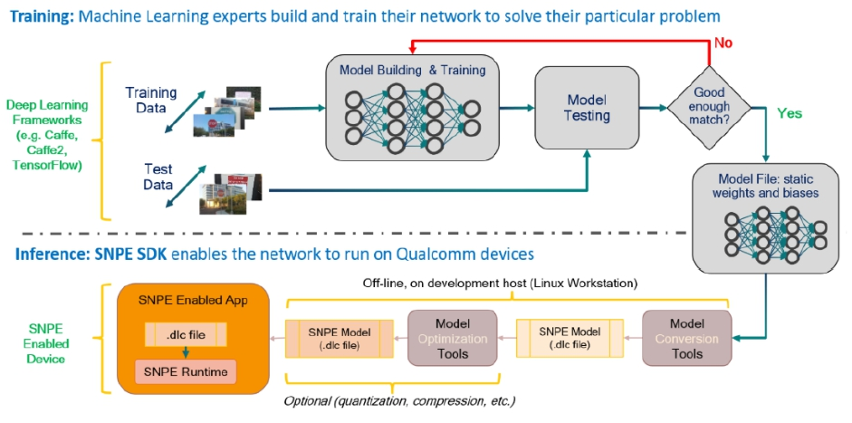
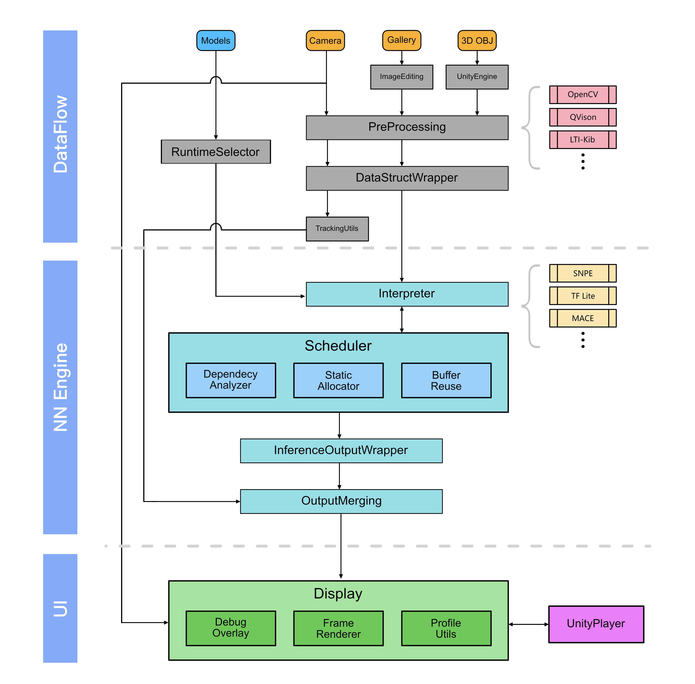
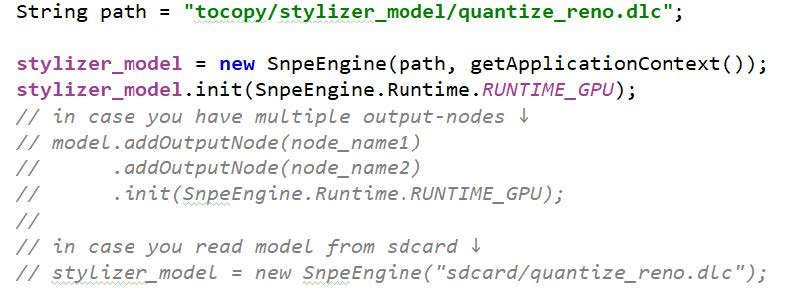
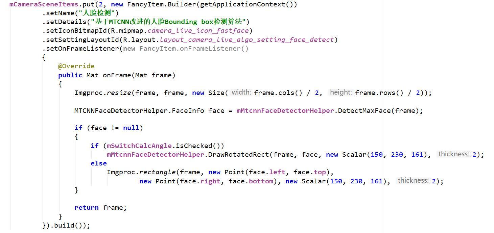
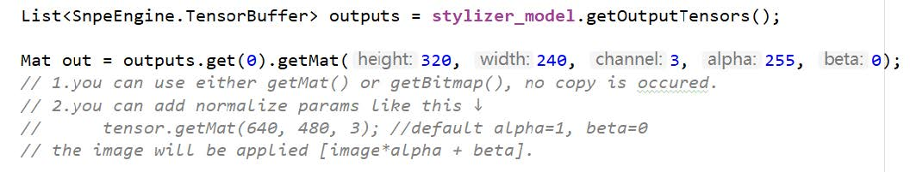
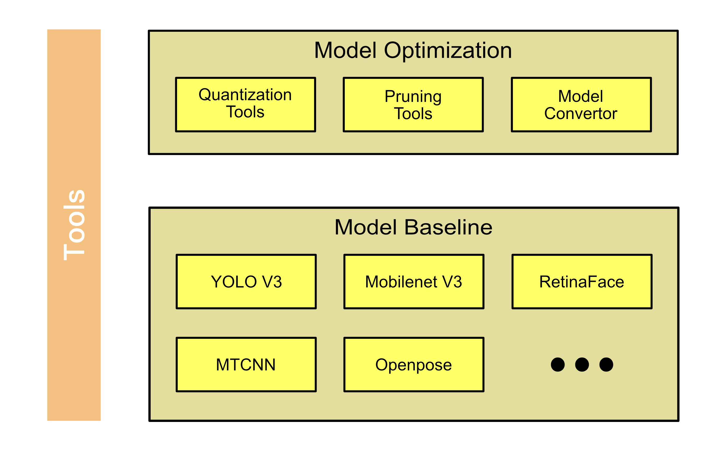
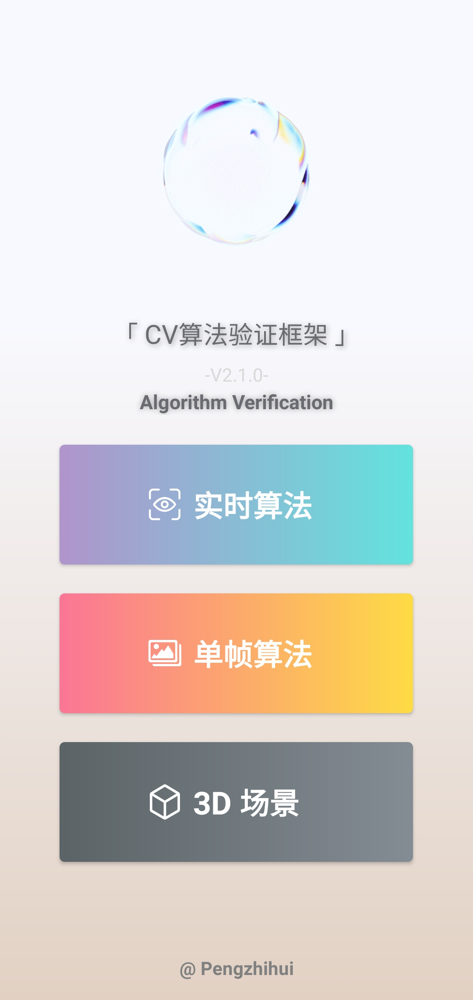

## 前言

一个算法模型的落地需要经历从算法任务确立，到方法调研、模型选型和优化、数据采集标定、模型训练、部署验证等一整个pipeline，其中对于绝大多数的算法工程师，模型的训练和输出是没有问题的，但是要快速地进行模型在移动设备上的效果验证，则需要移动端开发人员和配合才能完成。另一方面，考虑到团队内CV算法研究方向很多，如果每个模型都单独在移动端开发一套验证APP的话显然费时费力，重复造轮子。

为了解决模型移动端部署验证困难，以及每个模型都单独在移动端开发一套验证APP带来的重复工作的问题，本项目实现了CV算法快速验证框架项目，旨在提供一套通用的CV算法验证框架。框架经过本人一年多的开发和维护，目前已经完成绝大部分API的开发，实现包括实时视频流模块、单帧图像处理模块、3D场景模块、云端推理模块等众多功能。

> **大家可以看到我做的很多其他项目都用到了这个框架，比如L-ink、火星车等，本仓库将这个框架的非核心部分开源出来，代码里整合了重新编译的OpenCV native和JAVA库，大家可以自己扩展用于实现自己的项目。**

## CV算法验证框架设计

构建包含推理的应用程序所涉及的不仅仅是运行深度学习推理模型，开发者还需要做到以下几点：

- 利用各种设备的功能
- 平衡设备资源使用和推理结果的质量
- 通过流水线并行运行多个操作
- 确保时间序列数据同步正确

本框架解决了这些挑战，将上述软件框架解耦为`数据流控制层`、`nn推理引擎层`，以及`UI层`进行框架实现，把数据流处理管道构建为模块化组件，包括推理处理模型和媒体处理功能等。

* 其中数据流控制层包含三个大的模块 -- 视频流模块、图片和编辑模块、3D场景模块，每个模块提供可供配置的数据流参数接口，同时提供了一些常用的工具包如`OpenCV`、`QVision`等用于作为模型的数据输入和预处理。

* nn推理引擎层则集成了一些移动端常用的推理框架比如`SNPE`、`TensorFlow Lite`等，并提供统一模板便于后续持续维护扩展其他推理框架。
* UI层则封装好了图像渲染模块，以及各种调试控件。在API方面，该算法验证框架提供了Native/JAVA/Script三个层次的API，前两者可以在Android工程中进行快速模型集成，Script API则不需要编写任何APP 代码，通过文本脚本解析的形式配置模型推理选项。

通过以上功能使开发者可以专注于算法或模型开发，并使用本框架作为迭代改进其应用程序的环境，其结果可在不同的设备和平台上重现。

下图是本框架的模块划分架构图：

## API接口说明

从图中各个模块的名字可以看出个模块的功能，输入是转换好的算法模型，以及图像数据流，其中图像数据流分为摄像头采集的视频数据帧、相册选取的单帧图像，以及应用于3DCNN的3维模型文件。

本框架提供了Native/JAVA/Script三个层次的API，前两者可以在Android工程中进行快速模型集成，其中Native为C/C++接口，提供JNI模板以及封装好的通信组件便于和JAVA进行数据交互；JAVA层则为Android API，使用和C++一样风格的进行封装，此外提供一些UI绘制函数接口；Script API则不需要编写任何APP 代码，通过文本脚本解析的形式配置模型推理选项。

举例在JAVA API下，算法模型在代码中的初始化方式如下，以高通平台的SNPE Runtime为例，只需要几行非常简单的代码即可加载并初始化模型：

如代码所示，模型文件的加载方式比较灵活，可以作为FileInputStream加载，也可以作为APP的Asset进行加载。

而图像数据的预处理和结果回调使用也非常简单，通过提供的OpenCV、QVison等CV库封装接口，可以方便地调取很多图像处理函数：

其中常用的一些操作比如数据的归一化等函数都经过底层优化，保证数据一致性和高效性，比如数据类型的转换使用了zero-copy：

同时OpenCV的编译开启了NEON指令、OpenMP多核等加速选项，对于图像的归一化等操作可以做到并行化加速。

**具体的接口reference说明请参考工程代码。**

## 模型优化算法实现和工具封装

除了APP侧的接口外，本CV算法验证框架提供了一套配套的模型优化工具（暂未开放），包括：

* 模型8bit量化工具
* 模型结构化剪枝工具
* 模型转换工具

使用TensorFlow或者PyTorch等Training框架训练好的pb、pth、onnx等模型文件并不能直接在移动端进行部署运行，而是需要做一些模型转换工作，本框架将各种转换工具打包，提供了一套方便的模型转换工具。

其中的模型量化工具基于TensorFlow的TOCO、Pytorch的QNNPACK等实现。

剪枝工具则是根据论文**Learning Efficient Convolutional Networks Through Network Slimming (ICCV 2017)**提到的模型剪枝方法进行复现实现的。

模型转换工具和具体的Inference Runtime有关，比如SNPE则是使用DLC转换脚本、TensorFlow使用的是TF Lite转换工具等等。

如上图所示，除了模型优化工具，框架的工具包中还提供了一些预训练和部署好的Model Zoo，用于做同平台性能对比测试的Baseline，目前以及实现部署好的有YOLO、MTCNN、Openpose等模型。

## API文档

**待补充，另外框架工具代码也还在整理中。**

## 框架在移动端的实际效果

> * Camera视频流、单帧图像，以及3D场景模块选择
>
> * 同一框架下可以同时验证多个算法模型
> * 模型实际运行效果

